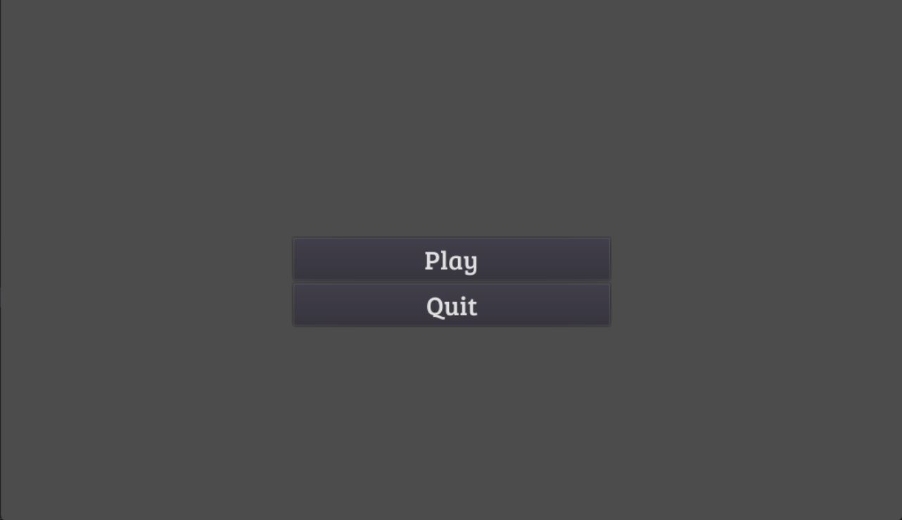
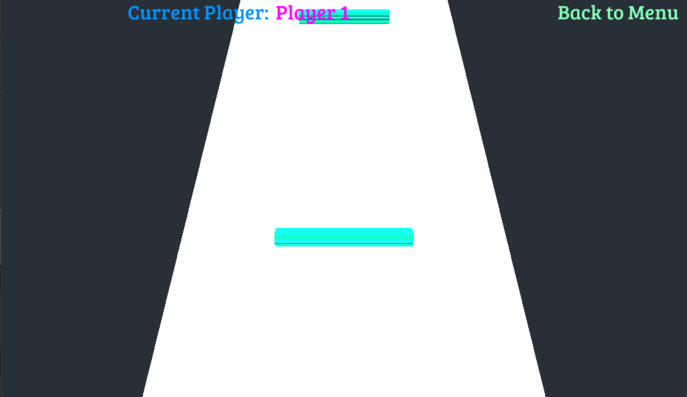
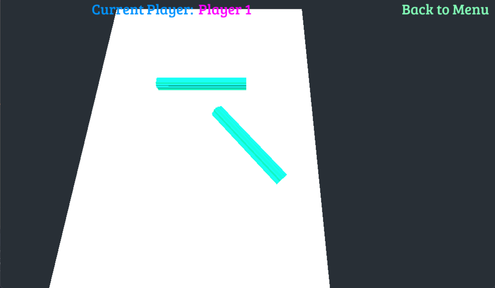
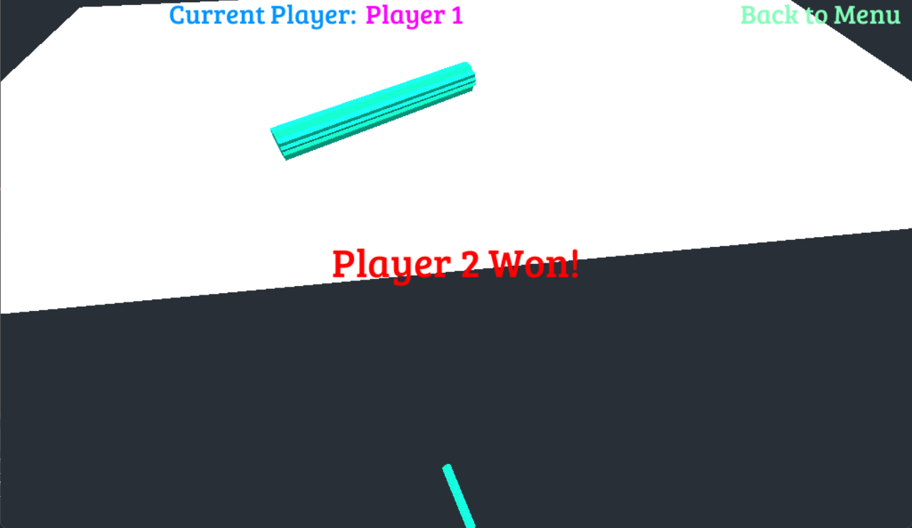

# Battle of Stationery (Beta)
Battle of Stationery is a simple game based on the game played by elementary school students in Taiwan.

## How to Play
When the game launches, select "Play" to start the game, or select "Quit" to exit the game.

After the game starts, the goal is to remove other players from the field by "flicking" your pencil so that it will rotate and collide with another.

To flick your pencil, double-click at the body of pencil. The position where you flick the pencil will affect the direction and rotation.
Press W, S, A or D to move the camera forwards, backwards, left or right, respectively. Scroll up or down to move the camera forwards, or backwards.

The remaining pencil on the field will be the winner.

